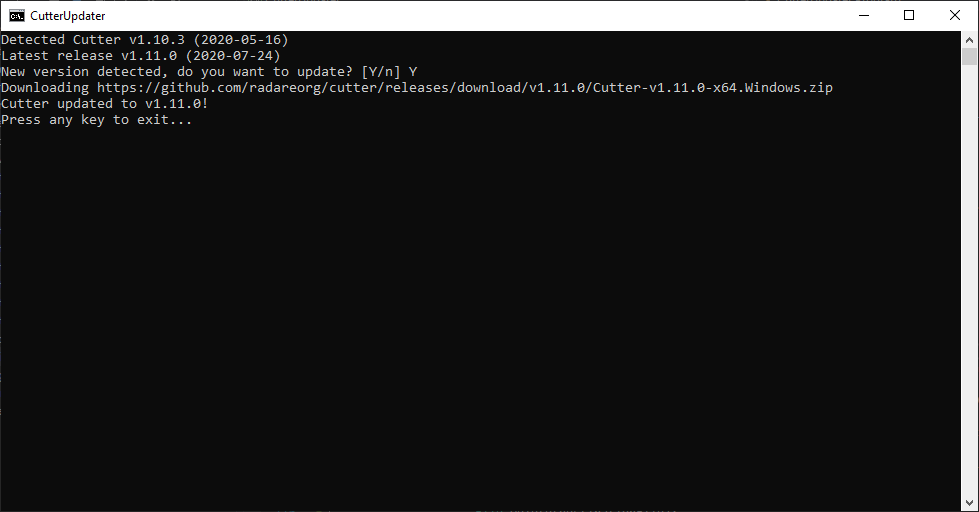

# CutterUpdater

Very simple utility to automatically check for, download and install the latest version of [Cutter](https://cutter.re).

## Installation

- Download the [latest release](https://github.com/mrexodia/CutterUpdater/releases)
- Copy `CutterUpdater.exe` next to `cutter.exe`
- Run `CutterUpdater.exe` whenever you want to install an update